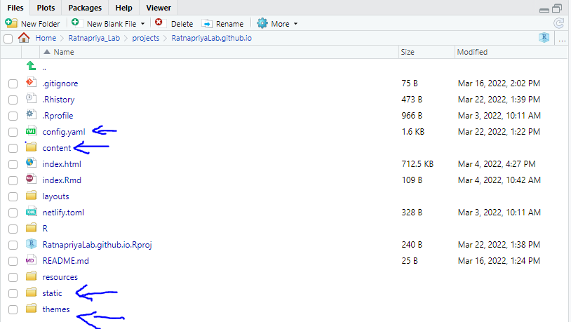

In the last tutorial, I think you were able to get Rstudio set up for making changes to our website. Now, how do we exactly change things? Well, that's what we're going to learn today. Follow along with your Rstudio project open.

There's only a few files and directories you need to make great advancements in our website. They are config.yaml, content, static, and themes.\

The most important file is **config.yaml**. This file contains information about the menu at the top, website title, themes and so on. If you want to add, remove, or change the menu, this is where you should look first. Also if you want a COMPLETELY different aesthetics and everything, this is it (Changing the theme will be a huge pain though, just letting you know).

Next up is the **content** directory. This directory contains all the pages on our website. If you want to change a specific page, like the main page or the research page, this is it. For example, the **_index.md** file in **content** is the main page, and the **_index.md** in the **research** page is the main research page.

The **static** directory is pretty simple. It just has some pictures and diagrams. You can also just have pictures in the same directory as your page is in the **content** directory as well. 

The **themes** directory is where it gets a bit complicated. If you're not familiar with html and css, I wouldn't recommend doing too much with it. This is where things like the aesthetics and general page layout is changed.

For more specific tutorials, look at the [blogdown documentations](https://bookdown.org/yihui/blogdown/).

