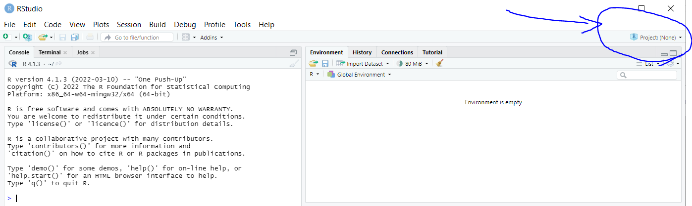
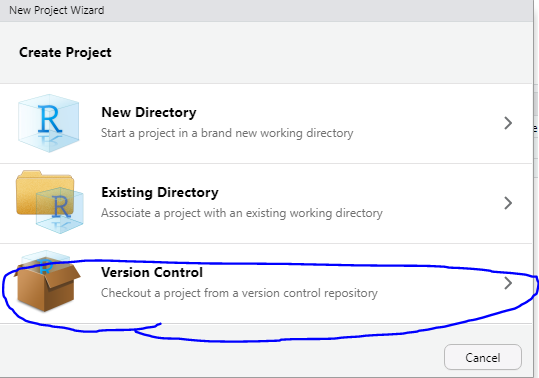
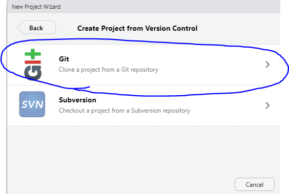
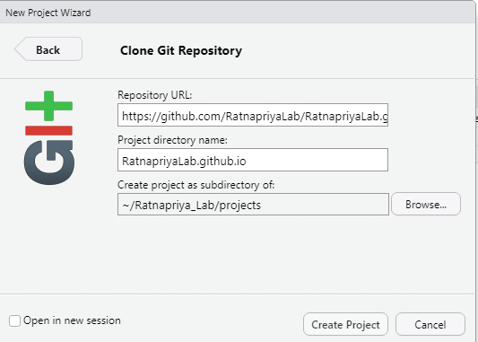

## Hey there

Looks like you want to start editing this website huh? Well, the first thing you need to do is install R and Rstudio. \
R: https://www.r-project.org/ \
Rstudio: https://www.rstudio.com/products/rstudio/download/

After you get those installed and ready to go, install git as well. \
https://git-scm.com/downloads

### Setting Rstudio Up
Now, open a fresh Rstudio window and install "[blogdown](https://bookdown.org/yihui/blogdown/)" like this. 
```{r}
install.packages("blogdown")
```

After blogdown is installed, go to the top right where it says "Project" and click on "New Project".\


You should see a popup like this, and select version control:\


Then select Git.\


Now just copy paste the website repository on our Github.\


Now you're ready to rock on and change the world!

